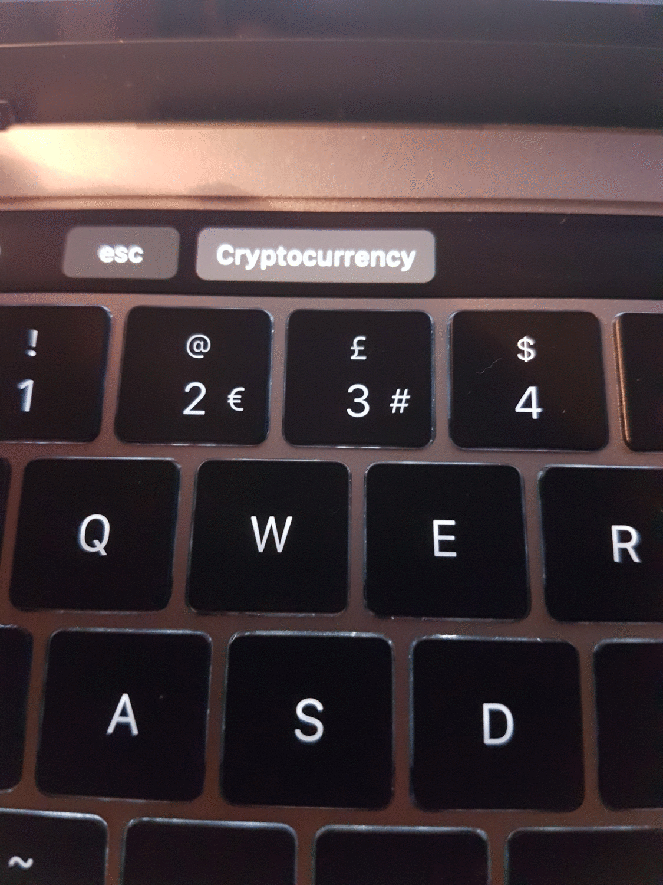

# BTT-TouchBarScript
CryptoCurrency touchbar button to pull price and 24H volume



# Steps: Adding a script - 

###### Step 1

NOTE: PLEASE INSTALL VERSION 2.8: https://bettertouchtool.net/releases/ - There are bugs with the newer version. You get a 45 day trial, 100% worth buying the license.

Download python 3.7: https://www.python.org/

You will need to also install the CoinGeckoAPI dependency via pip, the command is:  ```pip3 install pycoingecko```

###### Step 2

Select "TouchBar" located at the top right

###### Step 3

Select "+ Button Group" located at the bottom right

###### Step 4

At the bottom of the window a window will appear saying "Touch bar Button Group Name". For this example I've named it "CRYPTO"

###### Step 5

Next you want to add a TouchBar Widget/Gesture. To do this select "+ Widget/Gesture". Under "Select Touch Bar Widget/Gesture"
scroll down and select "Run Shell Script and Show Return Value".

###### Step 6

Once you've done step 5, a window will appear where you will input the name of your TouchBar button and what will appear on the
button itself simply enter in: [Click Here](https://prnt.sc/nbubaw) and click save.

###### Step 7

Now, at the bottom right you'll see "Predefined Action", click onto the drop down and select as shown [here](http://prntscr.com/nbudop)

###### Step 8

Final step, you'll now be presented with a pop-up window simply enter in what is shown [here](http://prntscr.com/nbugbe). Note that it is the file location of where you've downloaded the "AVA.py" script, so put it somewhere you can remember.

And thats it... You're done! 

# Adding Icons To Button (As shown in the GIF) - 

First of all you'll need to source your desired icon, many projects have a graphic bundle, you can use this as your icon for each button.

###### Step 1

Select your desired script, underneath "Run Shell Script and Show Return Value".

###### Step 2

Click onto "Advanced Configuration" and then onto "Appearance & Settings" 

###### Step 3

On the right hand side of the window you will see "Icon" and next to this a blank box with a dot in the middle. Simply click in the middle to be prompted to the next window 

###### Step 4

Once the pop up window has appeared, select "From Disk' and locate your icon from your directory and click "Open"

###### Step 5

Now, you will see you have an icon on your button. 

If you want to make it more aesthetically pleasing, you can make the background of the button the same colour as your icon. To do this select "Background Color" and at the bottom left of the pop-up window you will see a colour picker, click onto this and hover over your icon and click to save the colour. 

That is it! Your button (background) will be the same colour as your icon.

